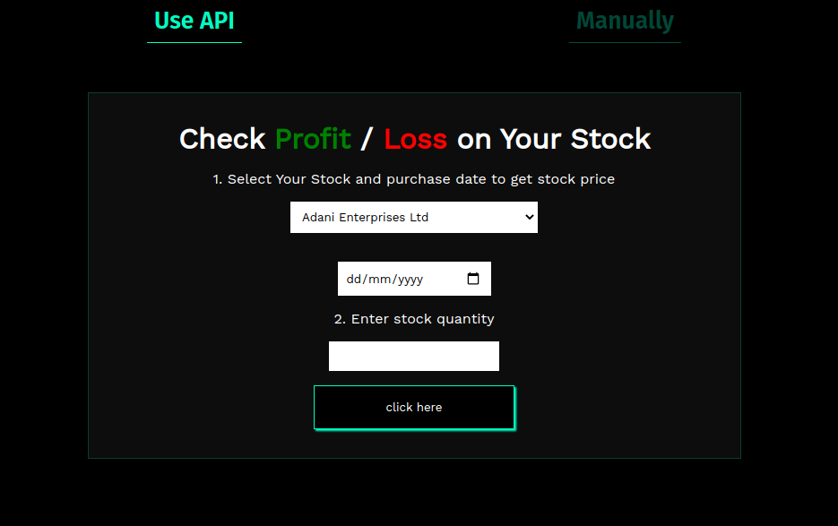

# neoG - Mark-14 Profit / Loss
This is a solution to the [Mark-14 of neoG camp](https://neog.camp/guide/mark-14).

## Table of contents

- [Overview](#overview)
  - [The challenge](#the-challenge)
  - [Screenshot](#screenshot)
  - [Links](#links)

## Overview
- Calculate Profit or Loss on stocks in absolute and percentage value.

### The challenge

- Take the user's stock price for one stock when he bought it.
- Take the stocks quantity as well.
- Now take today's price of that Stock.
- Tell the Profit / Loss, the user's making -
- In Percentage
- In Absolute

### Screenshot

### Links

[- Live Site URL](https://git-0r.github.io/mark14_profit-loss/)
